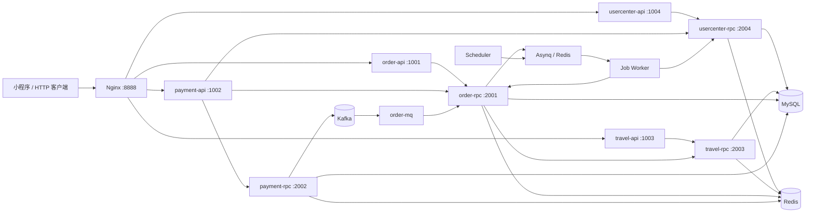
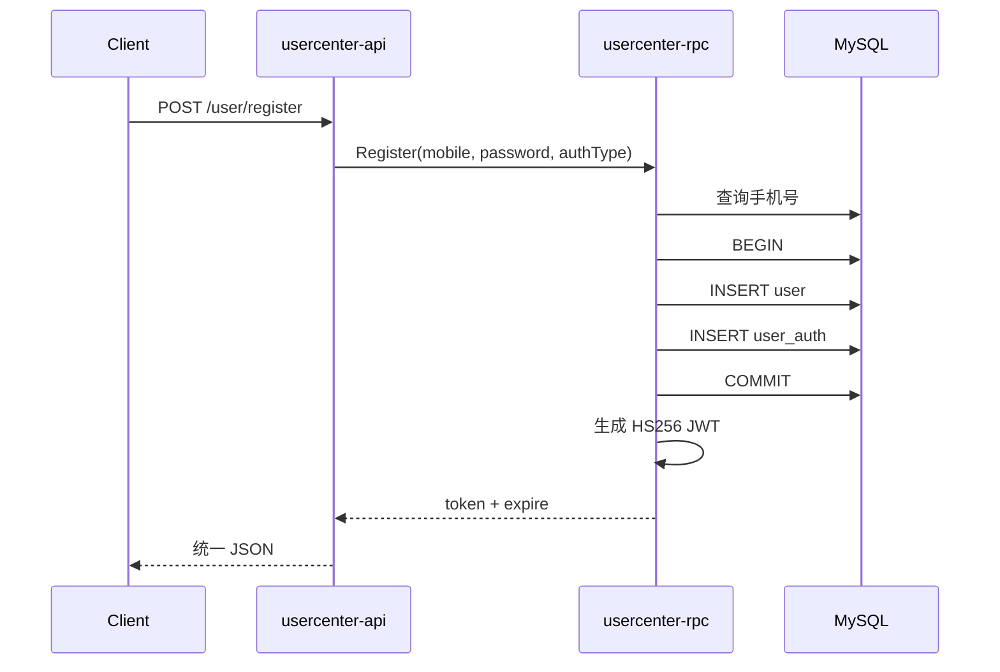
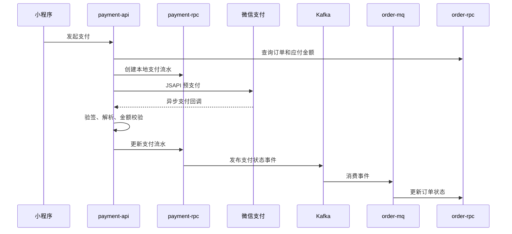

# go-zero-looklook 项目面试重点讲解

> 定位：一套基于 go-zero 的民宿业务微服务示例，覆盖用户、民宿、订单、微信支付、异步消息、延迟任务、定时任务、日志、指标、链路追踪和容器化部署。
>
> 本文不是对 README 的重复，而是按照“面试时怎么讲、源码里怎么实现、方案有什么边界”组织。运行验证日期：2026-07-13。

## 一、先记住这段项目介绍

### 30 秒版本

这是一个用 Go 和 go-zero 实现的民宿微服务项目。系统按用户、民宿、订单、支付拆成 4 个业务域，每个业务域采用 HTTP API 加 gRPC RPC 的分层方式，Nginx 统一对外路由。MySQL 保存业务数据，Redis 同时承担 go-zero 数据缓存和 Asynq 任务存储；支付状态通过 Kafka 解耦支付服务与订单服务，未支付订单通过 Asynq 延迟任务自动关闭。可观测性使用 Prometheus、Grafana、Jaeger，以及 Filebeat、Kafka、go-stash、Elasticsearch、Kibana。开发环境用 Docker Compose，生产方案可迁移到 Kubernetes。

### 3 分钟版本

项目最值得讲的不是 CRUD，而是三个完整链路：

1. 用户注册会通过 API 调用 usercenter-rpc，在一个本地事务中同时写入用户表和认证表，再签发带 `jwtUserId` 的 JWT；后续 API 通过 go-zero JWT 中间件完成鉴权，并从 Context 中取得用户 ID。
2. 创建订单时，order-api 调用 order-rpc，order-rpc 再调用 travel-rpc 获取民宿快照和价格，计算房费与餐费并落库；随后向 Asynq 写入一个 30 分钟延迟任务。Worker 到期后再次查询订单，仅把仍处于待支付状态的订单改为取消，避免误关已支付订单。
3. 微信支付回调先验签、校验本地支付流水和金额，再用乐观锁更新支付流水；支付服务通过 Kafka 发布支付状态，order-mq 消费后更新订单状态。这样第三方支付回调不用同步耦合订单服务。

工程层面还统一了错误码：RPC 拦截器把业务 `CodeError` 转为 gRPC Status，API 层再还原成统一 JSON，详细堆栈只进日志，前端只看到友好错误。Prometheus 采集 11 个业务进程，Jaeger 可以看到 HTTP → RPC → RPC 的完整跨服务链路。

## 二、实际运行结论

### 已真实验证

- `go test ./...` 通过，全部 Go 包可以编译；仓库绝大多数业务包没有测试文件，不能把“编译通过”表述成“测试覆盖充分”。
- 4 个 API、4 个 RPC、1 个 Kafka Consumer、1 个 Asynq Worker、1 个 Asynq Scheduler，共 11 个业务进程全部启动。
- MySQL 初始化 4 个库、8 张业务表；Kafka 初始化 2 个 Topic。
- 注册、登录、JWT 用户详情、民宿详情、创建订单、订单列表、订单详情接口均成功。
- 实测订单金额计算正确：2 晚房费 600 元，加 2 人 × 2 天餐费 80 元，总价 680 元。
- Redis 中存在对应的 30 分钟延迟关单任务。
- Prometheus 中 11 个业务 Target 全部为 `up`。
- Jaeger 已收到 usercenter、travel、order 的 API/RPC 实际调用链。
- Elasticsearch、Kibana、Grafana、Prometheus、Jaeger、Asynqmon 均返回 HTTP 200。

微信支付没有做真实资金链路测试：仓库配置使用的是脱敏示例商户信息，真实预支付和回调验签必须由项目所有者提供有效 AppID、商户号、APIv3 Key 和证书。这部分结论来自源码审查，不应在面试中声称已经完成真实付款验证。

### 本机启动时发现的环境问题

这些问题很适合在面试中体现排障能力：

- 宿主机 `9092` 已被另一个 Kafka 占用。本次没有停止用户的其他容器，而是临时把本项目 Kafka 的宿主端口改为 `19092`；容器内仍使用 `kafka:9092`，业务配置无需改变。
- 两份 Compose 对同一个 `looklook_net` 分别声明了 `172.16.0.0/16` 和 `172.20.0.0/16`。新版 Compose 会尝试重建正在使用的网络。本次通过临时 override 让业务容器复用基础环境网络。
- Elasticsearch 和 Kafka 的宿主机数据目录最初归 root 所有，而镜像进程使用 UID 1000，导致写入失败；修正目录所有者后恢复。
- MySQL 初始 root 账号只允许本机连接，需要按项目文档把 Host 放开到 `%`，否则业务容器会收到 MySQL 1130。
- WSL/Docker Desktop 下，仓库配置的 `/var/lib/docker/containers` 挂载为空，Filebeat 无法读取 Engine VM 中的日志。本次临时把业务容器改为 Syslog Driver，由 Filebeat UDP Input 接收；最终已在 Elasticsearch 生成 `looklook-2026-07-13` 日志索引。原生 Linux Docker 不需要这个兼容层。

这些调整均未修改仓库中的 Compose 文件，使用的是 `/tmp` 下的临时覆盖配置。

## 三、总体架构



### 服务职责

| 业务域 | API/RPC | 主要职责 | 数据库 |
|---|---|---|---|
| usercenter | 1004 / 2004 | 注册、登录、JWT、用户资料、微信授权 | `looklook_usercenter` |
| travel | 1003 / 2003 | 民宿、商家、活动、评论查询 | `looklook_travel` |
| order | 1001 / 2001 | 下单、订单列表/详情、订单状态机 | `looklook_order` |
| payment | 1002 / 2002 | 微信预支付、支付回调、支付流水 | `looklook_payment` |
| order-mq | 无 HTTP / 3001 | 消费支付状态 Kafka 消息并驱动订单状态 | 无独立库 |
| mqueue-job | 4010 指标端口 | 消费延迟任务、定时任务、通知任务 | Redis 任务数据 |
| mqueue-scheduler | 4011 指标端口 | 注册 Cron 定时任务 | Redis 任务数据 |

### 为什么 API 和 RPC 分开

- API 是协议适配和聚合层：解析 HTTP、做 JWT、从 Context 取用户身份、组装多个 RPC 结果、统一返回 JSON。
- RPC 是可复用业务能力层：实现事务、状态变更、数据访问，供 API、MQ 和 Job 共同调用。
- 例如关闭订单不是复制 order-api 的代码，而是 Worker 调 order-rpc；支付成功也由 order-mq 调 order-rpc。这保证状态变更入口相对集中。
- 当前开发环境把所有二进制放进同一个 `looklook` 容器并使用 `127.0.0.1` 直连。生产部署可以把进程拆成多个 Pod，再用 Kubernetes Service 地址连接。

## 四、go-zero 项目骨架怎么读

一个典型 API 请求的代码路径是：

```text
*.api 定义协议
  → internal/types 生成请求/响应结构
  → internal/handler/routes.go 注册路由和中间件
  → internal/handler 解析参数
  → internal/logic 编排业务
  → internal/svc/ServiceContext 提供 RPC Client、Model、配置等依赖
```

一个典型 RPC 请求的代码路径是：

```text
*.proto 定义服务
  → pb/*.pb.go 生成消息和 gRPC 代码
  → internal/server 适配 gRPC 请求
  → internal/logic 实现业务
  → internal/svc/ServiceContext 组装 Model、Redis、RPC Client、Kafka Client
  → model 访问 MySQL/Redis Cache
```

`ServiceContext` 是项目的依赖容器。构造时集中初始化 DB Model、RPC Client、Asynq Client 和 Kafka Producer，Logic 只依赖它，不在每次请求中重复创建连接。

## 五、关键模块一：用户、事务与 JWT

### 注册调用链



源码重点：

- `app/usercenter/cmd/api/internal/logic/user/registerLogic.go`：API 到 RPC 的协议转换。
- `app/usercenter/cmd/rpc/internal/logic/registerLogic.go`：检查重复用户，用 `UserModel.Trans` 保证 `user` 和 `user_auth` 同时成功或同时回滚。
- `app/usercenter/cmd/rpc/internal/logic/generateTokenLogic.go`：JWT 中写入 `exp`、`iat` 和 `jwtUserId`。
- `pkg/ctxdata/ctxData.go`：从 Context 中读取 go-zero JWT 中间件解析后的用户 ID。

### 数据模型为什么分 `user` 与 `user_auth`

`user` 保存业务用户资料，`user_auth` 保存认证方式。`auth_type + auth_key` 唯一，因此同一用户可以扩展手机号、微信、小程序等多种登录方式，而不需要把所有第三方账号字段塞进用户表。

### 面试追问

**为什么注册需要本地事务？** 只写成功用户表而认证表失败，会产生无法登录的脏用户；两表在同一数据库，使用本地事务比引入分布式事务更简单可靠。

**JWT 有什么优缺点？** 服务端无需 Session 查询，适合横向扩容；但签发后难以主动失效。当前 Token 有效期是一年，生产应缩短 Access Token，有 Refresh Token、黑名单或密钥轮换机制。

**当前密码方案安全吗？** 不安全。源码使用无盐 MD5，只适合教学演示；生产应使用 bcrypt、scrypt 或 Argon2，并配置登录限流、失败锁定和敏感日志脱敏。

## 六、关键模块二：民宿查询与缓存 Model

travel-api 提供民宿列表、猜你喜欢、商家列表、民宿详情和评论列表。列表 Logic 通常使用并发聚合或分页查询，详情能力通过 travel-rpc 暴露给订单服务复用。

goctl 生成的 Model 基于 `sqlc.CachedConn`：

- 按主键或唯一索引查询时先访问 Redis Cache，未命中再查 MySQL。
- 写操作通过 `ExecCtx` 自动清除关联缓存 Key，避免手写缓存失效逻辑。
- 唯一索引查询会建立“索引 Key → 主键 → 数据”的缓存关系。
- 列表、聚合查询使用 NoCache 方法，因为组合条件多、缓存失效成本高。
- 表统一包含 `del_state`、`delete_time`，实现软删除。

### 乐观锁

生成的 `UpdateWithVersion` 使用类似下面的 SQL：

```sql
UPDATE table
SET ..., version = version + 1
WHERE id = ? AND version = ?;
```

受影响行数为 0 表示数据已被其他请求修改。支付流水和订单状态更新都使用该机制，能阻止并发回调把旧状态覆盖新状态。

面试时要补充：乐观锁只负责发现冲突；高并发生产代码还应明确冲突后的重试、幂等返回或人工补偿策略。

## 七、关键模块三：创建订单与延迟关单

### 创建订单完整链路

1. order-api 通过 JWT Context 取得当前用户 ID，不能相信前端直接传用户 ID。
2. order-rpc 校验入住结束时间必须晚于开始时间。
3. 调用 travel-rpc 获取民宿详情和当前价格。
4. 把标题、封面、房东、房价等复制进订单，形成交易快照，避免民宿以后改价导致历史订单内容变化。
5. 计算入住天数、房费、餐费和总价；金额在库中以“分”为单位保存，避免浮点金额误差。
6. 生成业务订单号，初始状态设为待支付并写 MySQL。
7. 向 Asynq 提交一个 `ProcessIn(30 * time.Minute)` 的延迟关单任务。

核心源码：

- `app/order/cmd/api/internal/logic/homestayOrder/createHomestayOrderLogic.go`
- `app/order/cmd/rpc/internal/logic/createHomestayOrderLogic.go`
- `app/order/cmd/rpc/internal/svc/asynqClient.go`
- `app/mqueue/cmd/job/internal/logic/closeOrder.go`

### 为什么用 Asynq 而不是 `time.Sleep`

- `time.Sleep` 依赖当前进程存活，重启后任务丢失。
- 每个订单持有一个 Goroutine 也难以治理和观测。
- Asynq 把任务持久化在 Redis，支持重试、并发 Worker、延迟执行和 Asynqmon 可视化。

### 到期处理为什么还要查一次状态

延迟任务创建后，用户可能已完成支付。Worker 到期后重新查询订单，仅当状态仍为“待支付”才取消。这是异步系统中非常重要的“执行前二次校验”，保证重复执行或状态已推进时不会产生错误结果。

### 当前一致性边界

订单落库和 Asynq 入队不是一个原子操作。源码中入队失败只记录日志，仍然返回下单成功，可能出现永不自动关闭的订单。生产可选方案：

- 在订单库写 Outbox 事件，由可靠扫描器投递任务；
- 增加定时补偿，扫描超时待支付订单；
- 设计幂等任务 Key，防止补投造成副作用。

## 八、关键模块四：微信支付、幂等与 Kafka

### 支付链路



### 回调安全检查

- 使用微信平台证书验证回调签名并解密通知。
- 根据微信商户订单号查询本地支付流水。
- 比较回调金额与本地金额，防止篡改或串单。
- 如果本地流水已不是待支付，直接返回，形成基础幂等保护。
- 更新使用 `version` 乐观锁，进一步防止并发回调覆盖。

### 为什么支付成功后用 Kafka

支付服务只负责确认支付事实，不应同步知道订单、积分、通知、结算等所有下游。发布领域事件后，各消费者可以独立处理并单独扩容。Kafka Consumer Group 保证同一 Group 内一条消息只由一个消费者实例处理，同时保留消息以便故障恢复。

### 必须诚实说明的代码问题

源码当前有一个关键标识传递错误：`UpdateTradeStateLogic` 发布消息时传的是 `in.Sn`（支付流水号），而 order-mq 把消息中的 `OrderSn` 当业务订单号查询。这会导致真实支付成功后找不到订单。正确做法应发布 `thirdPayment.OrderSn`，并给事件字段明确命名。

另外还有三个改进点：

- 更新支付流水与发布 Kafka 消息不是原子操作，Producer 失败只记日志，存在支付已成功但订单未推进的风险；应采用 Transactional Outbox、可靠重试和对账补偿。
- 回调调用 `UpdateTradeState` 时没有传 `PayTime`，当前代码会把支付时间写成 Unix 零值。
- `CreatePaymentLogic` 忽略传入的 `ServiceType` 并硬编码民宿订单类型，扩展其他业务支付时会出错。

能主动指出并给出修复方案，比把项目描述成“完全没有问题”更有说服力。

## 九、关键模块五：消息、延迟任务、定时任务怎么区分

| 类型 | 本项目实现 | 适用场景 | 关键特征 |
|---|---|---|---|
| 发布订阅 | Kafka + go-queue/kq | 支付状态广播 | 高吞吐、消费者组、跨服务解耦 |
| 延迟任务 | Asynq `ProcessIn` | 30 分钟关单 | 每条任务有独立执行时间 |
| 普通任务 | Asynq Worker | 微信订阅通知 | 重试、并发消费 |
| 定时任务 | Asynq Scheduler + Cron | 每分钟结算示例 | 按固定表达式周期触发 |

Scheduler 只负责按 Cron 产生任务，Worker 负责执行任务。拆开后可以独立部署、扩容，也避免 Scheduler 自己执行耗时业务而阻塞后续调度。

## 十、统一错误处理

项目希望同时满足两件事：前端收到稳定友好的错误，服务端日志保留参数、调用位置和堆栈。

链路如下：

1. Logic 使用 `xerr.CodeError` 表示可公开的业务错误，再用 `errors.Wrapf` 增加仅供服务端排障的上下文。
2. `pkg/interceptor/rpcserver/loggerInterceptor.go` 取根因；若是 `CodeError`，转换为带自定义数字 Code 的 gRPC Status。
3. API 的 `pkg/result/httpResult.go` 同时识别本地 `CodeError` 和 gRPC Status。
4. 已登记的业务错误返回给前端；数据库和系统底层错误统一隐藏为“服务器开小差”，完整错误只记录日志。
5. 成功响应统一为 `{code: 200, msg: "OK", data: ...}`。

### 方案评价

优点是错误跨 HTTP/gRPC 边界仍保持统一，业务代码无需到处打印日志。缺点是把十万级业务码强转成 gRPC `codes.Code` 并不符合标准 gRPC Code 的有限枚举语义。更规范的做法是使用标准 gRPC Code 表示错误类别，并把业务码放进 Error Details 或响应元数据。

## 十一、可观测性链路

### 指标

每个进程在独立 4001～4011 端口暴露 `/metrics`，Prometheus 拉取，Grafana 展示。重点关注 QPS、请求耗时分位数、错误率、RPC 超时、Kafka Lag、Asynq 队列长度、MySQL/Redis 连接池和资源利用率。

### 链路追踪

所有 API/RPC 配置 `Telemetry`，go-zero 自动注入和传播 Trace Context，Jaeger Collector 接收 Span，Elasticsearch 持久化。本次实测一个请求可在 Jaeger 中跨 usercenter-api/usercenter-rpc 或 order-api/order-rpc/travel-rpc 查看。

### 日志

```text
容器 stdout
  → Filebeat
  → Kafka looklook-log
  → go-stash
  → Elasticsearch
  → Kibana
```

相比直接让 Filebeat 写 ES，中间加 Kafka 可以削峰、缓冲和解耦；相比 Logstash，go-stash 更轻量。日志中包含 trace/span 字段，可以从错误日志跳到链路追踪。

## 十二、部署与服务发现

- 开发环境：Docker Compose + modd 热编译。所有 Go 二进制在同一容器内，因此 RPC 使用 `127.0.0.1` 直连。
- 测试/生产：文档给出 GitLab → Jenkins → Harbor → Kubernetes 的发布链路。
- 项目没有使用 etcd/Nacos/Consul。开发环境直连，Kubernetes 环境可使用 Service DNS 和平台自身的服务发现/负载均衡。
- Nginx 根据 `/usercenter/`、`/travel/`、`/order/`、`/payment/` 前缀转发到不同 API。

面试时不要说“项目已经使用 DTM”。README 明确写的是准备集成，当前业务源码没有 DTM 分布式事务。也不要把 Docker Compose 中“多个进程共用一个容器”的开发布局说成生产最佳实践；生产应按进程/服务拆分容器，单独设置资源、探针和副本数。

## 十三、项目真正的亮点与不足

### 亮点

- 不是单体 CRUD，而是 HTTP、gRPC、Kafka、Asynq、MySQL、Redis 组成的完整微服务调用链。
- 用户注册体现本地事务；支付回调体现验签、金额校验、幂等和乐观锁。
- 订单创建保存交易快照，金额使用分存储，延迟关单执行前二次校验。
- API、RPC、MQ、Job 复用业务 RPC，服务职责相对清晰。
- 错误、日志、指标、Trace 都有统一工程方案。
- Compose、Kubernetes、CI/CD 文档覆盖了从开发到部署的路径。

### 不足和改进优先级

P0：

- 修复支付事件把支付流水号误当订单号的问题。
- 给支付状态更新加 Outbox/可靠事件，补充支付对账和状态补偿。
- 密码从 MD5 升级为带盐慢哈希，密钥和密码移出仓库，使用 Secret 管理。

P1：

- 订单落库与延迟任务之间增加 Outbox 或超时订单补偿扫描。
- 增加库存/房态模型，防止同一房源同一日期被重复预订。
- 为支付回调、Kafka Consumer、Asynq Job 设计显式幂等键和去重表。
- 缩短 JWT 有效期并增加 Refresh/撤销机制。
- 补充单元测试、RPC 集成测试、容器化端到端测试；当前业务测试覆盖很少。

P2：

- 修正两份 Compose 的网络子网冲突，加入 Healthcheck 和自动初始化 SQL/Topic。
- API 列表空数据应返回 `[]` 而不是 `null`。
- `order.proto` 已定义 `needFood`，但仓库中的 `order.pb.go` 没有对应字段，说明生成文件与 Proto 不同步；实测数据库为 1、订单详情却返回 0。应重新生成并提交 RPC 代码，同时在 CI 中检查生成物漂移。
- 统一中英文命名和注释，修复 `homestayBussiness` 等拼写。
- 对列表查询、Kafka Lag、队列积压增加告警规则。

## 十四、高频面试题与回答要点

### 1. 为什么拆成这四个服务？

按业务能力和数据所有权划分：用户、商品/民宿、交易订单、支付流水的变化原因和扩容特征不同。拆分后支付可以独立做安全与对账，订单可以独立承载交易状态。但项目规模较小时也可以先做模块化单体，避免过早承担分布式复杂度。

### 2. 为什么一个业务域还要 API + RPC？

API 面向客户端协议和聚合，RPC 面向内部复用。MQ 和 Job 也可以调用 RPC，不必重复业务逻辑。代价是调用链更长，需要超时、重试、熔断和 Trace。

### 3. 如何保证支付回调幂等？

先查本地支付流水，只有待支付才能推进；更新时带 version 乐观锁。生产还应给第三方 `transaction_id` 建唯一索引，对重复事件返回成功，并让下游状态变更也幂等。

### 4. Kafka 消息会不会丢？

当前“更新数据库后直接 Push，失败只记日志”会丢。可靠方案是在同一个数据库事务中写业务表和 Outbox 表，再由独立投递器重试发布；消费者成功处理后才提交 Offset，并以业务 ID 做幂等。

### 5. 缓存一致性怎么做？

go-zero Model 写数据库时清除相关缓存，读请求 Cache Aside。删除缓存失败、并发读写和列表缓存仍要考虑；关键数据可以缩短 TTL、订阅 Binlog 或使用延迟双删，但不能只靠永久缓存。

### 6. 为什么不用分布式事务？

注册的两张表在同库，用本地事务即可。订单、支付跨服务时更适合最终一致性：本地事务 + 领域事件 + 幂等消费者 + 补偿/对账。强行使用 2PC 会提高耦合和可用性成本。DTM 是可选方案，但当前项目未集成。

### 7. 延迟任务重复执行怎么办？

Worker 查询最新订单状态，只在待支付时取消，因此天然具备一定幂等性。进一步可以使用订单号作为唯一任务 ID，状态更新带期望旧状态或 version，并记录执行结果。

### 8. 如何应对服务故障？

同步 RPC 设置超时、限流、熔断和降级；异步链路依靠 Kafka/Redis 持久化与重试；通过 Prometheus 告警、Jaeger 定位慢链路、Kibana 查错误日志；最后用对账和补偿任务收敛不一致状态。

### 9. 项目中最值得讲的排障经历是什么？

可以讲本次完整启动：先发现 WSL 没有启动 Docker，启用 Docker Desktop；处理 Kafka 端口冲突时没有停止其他项目，而是改宿主映射；随后从容器日志定位 ES/Kafka 数据目录权限；最后根据 API 的统一 100005 错误，沿 Trace 找到 MySQL 1130 远程授权问题。每一步都用日志、端口、容器状态和真实接口结果验证，而不是只看到容器 `Up` 就结束。

## 十五、源码阅读顺序

建议按下面顺序准备面试，每读完一条都能讲出“入口—核心逻辑—数据—异常—一致性”：

1. `docker-compose.yml`、`docker-compose-env.yml`、`modd.conf`：先理解进程和中间件全貌。
2. `deploy/nginx/conf.d/looklook.conf`：理解统一入口。
3. `app/usercenter/cmd/api/internal/handler/routes.go`：看公开与 JWT 路由。
4. `app/usercenter/cmd/rpc/internal/logic/registerLogic.go`：看事务。
5. `app/usercenter/cmd/rpc/internal/logic/generateTokenLogic.go`：看 JWT。
6. `app/order/cmd/rpc/internal/logic/createHomestayOrderLogic.go`：看跨服务下单和延迟任务。
7. `app/mqueue/cmd/job/internal/logic/closeOrder.go`：看延迟任务幂等。
8. `app/payment/cmd/api/internal/logic/thirdPayment/thirdPaymentWxPayCallbackLogic.go`：看支付回调。
9. `app/payment/cmd/rpc/internal/logic/updateTradeStateLogic.go`：看乐观锁和 Kafka Producer。
10. `app/order/cmd/mq/internal/mqs/kq/paymentUpdateStatus.go`：看 Kafka Consumer。
11. `app/payment/model/thirdPaymentModel_gen.go`：看缓存、软删除、分页和乐观锁模板。
12. `pkg/interceptor/rpcserver/loggerInterceptor.go` 与 `pkg/result/httpResult.go`：看统一错误链路。

## 十六、面试表达注意事项

- 如果这是学习或二次开发项目，应说“我重点负责/深入实现和验证了哪些部分”，不要把原作者全部工作说成自己原创。
- 每个技术点都按“为什么用 → 怎么实现 → 有什么问题 → 如何改进”回答，避免只背中间件名词。
- 不要说“用了 Kafka 就绝不丢消息”“用了 JWT 就绝对安全”“有乐观锁就完全幂等”。这些都需要业务约束和补偿机制配合。
- 把支付事件标识错误、非原子投递和测试不足主动讲成代码审查发现与改造计划，会比回避问题更专业。

最后可以这样收束：这个项目帮助我把 go-zero 的 API/RPC 代码生成、数据库缓存、异步队列和可观测性串成了一条完整链路；如果继续生产化，我会优先补齐支付可靠事件、订单库存一致性、安全密钥管理和自动化测试。
